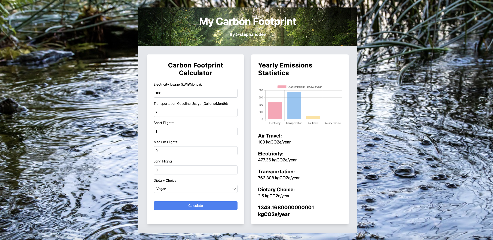

# Carbon Emissions Calculator App



## Overview

This application is designed to calculate carbon emissions per year based on user input data. It utilizes React for the front-end interface and TypeScript for type safety and enhanced code readability.

## Tech Stack

- React.js
- TypeScript
- Chart.js (for chart visualization)

## Carbon Emissions Calculation

The calculation of carbon emissions (e) is based on the formula:

Where:

- `usage`: Represents the usage amount in kWh (electricity), gallons (transportation), etc.
- `frequency`: Represents the frequency of usage (per month, per year, etc.)

## Installation

1. Clone the repository to your local machine:
   ```bash
   git clone https://github.com/yourusername/carbon-emissions-calculator.git
   ```

cd carbon-emissions-calculator
